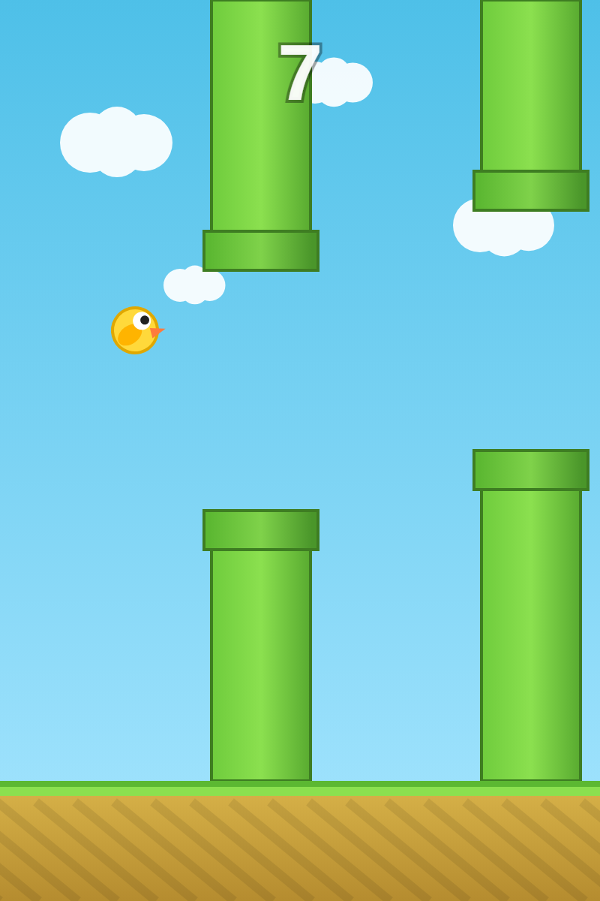

# Flappy Bird 🐦

一款纯前端、零依赖的 Flappy Bird 网页小游戏,双击 `index.html` 即可在浏览器畅玩。

<p align="center">
  
</p>

## 在线体验

👉 **https://tomlee0616.github.io/flappy-bird-auto/**

## 玩法

- **操作**:鼠标点击 / 空格键 / 方向键↑ / W 键 / 触摸屏幕,让小鸟飞起来,穿过管道。
- **超能力**:每穿过 6 个障碍随机获得一个超能力 —— 变小 / 超音速冲刺 / 炸弹;炸弹按 `B` 键或点右下角按钮释放。

## 功能

- 🎮 扁平几何风格,Canvas 纯代码绘制,无外部素材
- 🔊 音效:Web Audio API 合成(跳跃 / 得分 / 碰撞 / 超能力)
- 🏆 最高分:localStorage 持久化,破纪录提示
- 📈 难度递增:速度提升 + 开口收窄 + 20 分后管道上下移动
- ✨ 超能力系统:每过 6 个障碍随机获得超能力
  - **变小**(5s):缩小体型,更易穿过缝隙
  - **超音速冲刺**(2s):无视障碍,管道半透明,小鸟变红
  - **炸弹**:炸掉后面连续 3 根管道
  - **无敌帧**:获得能力后 / 能力消失后各 1 秒无敌
- 📱 移动端适配:触屏 + 竖屏 + 高清屏渲染

## 运行

直接双击 `index.html`,或部署到任意静态服务器(如 GitHub Pages)。

## 文件结构

```
flappybird/
├── index.html   # 页面结构 + Canvas + 遮罩层
├── style.css    # 布局与样式
├── game.js      # 全部游戏逻辑
├── preview.png  # 游戏预览截图
└── README.md
```
